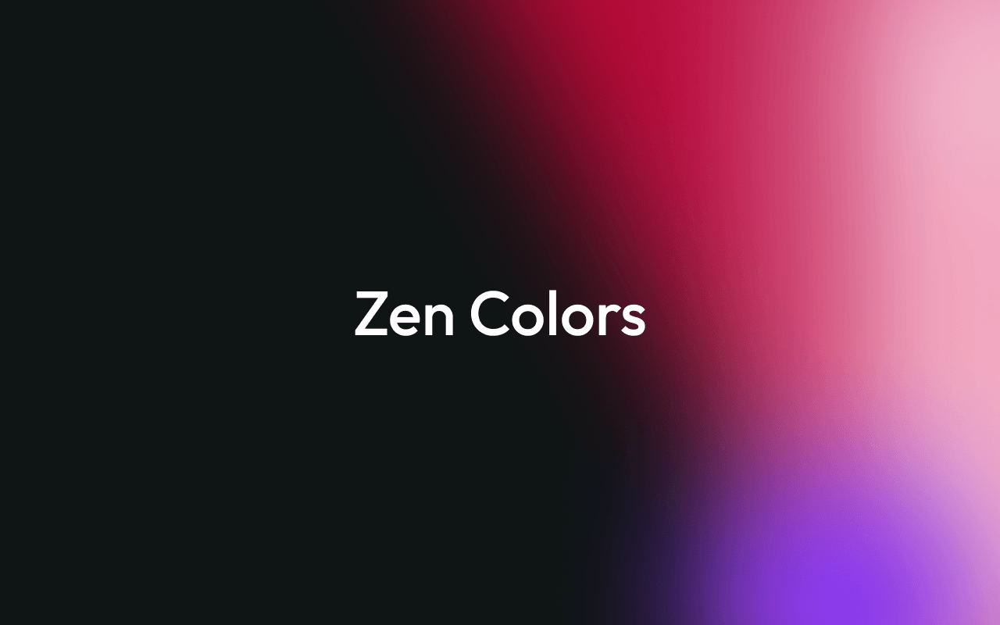

# Zen Colors

A React component for rendering beautiful animated color gradients. Powered by Canvas 2D with GPU-accelerated CSS blur for high performance.



## Installation

```bash
npm install zen-colors
```

## Quick Start

```tsx
import { ZenColors } from 'zen-colors';

function App() {
  return (
    <ZenColors
      width="100%"
      height={400}
      background="#0a0a0a"
      blur={80}
      blobs={[
        {
          color: '#ff0055',
          x: 65,
          y: 40,
          size: 40,
          animation: { type: 'drift', speed: 0.5, range: 10 },
        },
        {
          color: '#8800cc',
          x: 80,
          y: 70,
          size: 30,
          animation: { type: 'breathe', speed: 0.4, range: 12 },
        },
      ]}
    />
  );
}
```

## Using Presets

Twelve built-in presets are included for common color palettes:

```tsx
import { ZenColors, presets } from 'zen-colors';

// Spread a preset directly onto the component
<ZenColors width="100%" height={400} {...presets.ember} />
<ZenColors width="100%" height={400} {...presets.sakura} />
```

Available presets: `ember`, `amber`, `glacier`, `subtle`, `aurora`, `sunset`, `ocean`, `neon`, `lava`, `nebula`, `sakura`, `matrix`.

| Preset     | Description                                    |
| ---------- | ---------------------------------------------- |
| `ember`    | Red/crimson and purple creative energy         |
| `amber`    | Warm amber and orange focus tones              |
| `glacier`  | Cool blue and cyan productivity palette        |
| `subtle`   | Muted amber and magenta, understated           |
| `aurora`   | Green, teal and purple northern lights         |
| `sunset`   | Orange, pink and purple gradient sky           |
| `ocean`    | Deep blue and teal underwater tones            |
| `neon`     | Vibrant multi-color electric palette           |
| `lava`     | Molten orange and red, fast fluid glow         |
| `nebula`   | Deep-space violet, rose and cyan gas clouds    |
| `sakura`   | Soft cherry blossom pinks with morphing shapes |
| `matrix`   | Green digital rain cascading beams             |

## Component API

### `<ZenColors />`

| Prop                  | Type                        | Default      | Description                                               |
| --------------------- | --------------------------- | ------------ | --------------------------------------------------------- |
| `width`               | `string \| number`          | `'100%'`     | Container width (CSS value or px number)                   |
| `height`              | `string \| number`          | `'100%'`     | Container height (CSS value or px number)                  |
| `className`           | `string`                    | —            | CSS class for the wrapper div                              |
| `style`               | `CSSProperties`             | —            | Inline styles for the wrapper div                          |
| `background`          | `string`                    | `'#000000'`  | Background color                                           |
| `blobs`               | `BlobConfig[]`              | **required** | Array of blob definitions                                  |
| `blur`                | `number`                    | `60`         | CSS blur in px applied to the canvas                       |
| `blendMode`           | `GlobalCompositeOperation`  | `'lighter'`  | Canvas composite blending mode                             |
| `speed`               | `number`                    | `1`          | Global animation speed multiplier. Set to `0` for a static render |
| `interactive`         | `boolean`                   | `false`      | Blobs respond to mouse/touch                               |
| `interactionStrength` | `number`                    | `30`         | Mouse interaction strength (0–100)                         |
| `targetFps`           | `number`                    | `15`         | Target frames per second — limits canvas redraws. Supports fractional values (e.g. `0.5` = one frame every 2 s). Lower values save CPU/GPU |
| `resolution`          | `number`                    | `1`          | Canvas scale factor (lower = better perf)                  |
| `overflowPadding`     | `number`                    | `= blur`     | Extra padding to prevent blur clipping                     |
| `children`            | `ReactNode`                 | —            | Content rendered on top of the canvas                      |

### `BlobConfig`

| Property    | Type              | Default | Description                                    |
| ----------- | ----------------- | ------- | ---------------------------------------------- |
| `id`        | `string`          | —       | Unique identifier (preserves state on reorder) |
| `color`     | `string`          | —       | Any valid CSS color                            |
| `x`         | `number`          | —       | Horizontal position (0–100% of container)      |
| `y`         | `number`          | —       | Vertical position (0–100% of container)        |
| `size`      | `number`          | —       | Radius as % of min(width, height)              |
| `opacity`         | `number \| [min, max]` | `1`        | Fixed opacity (0–1) or a range that oscillates over `opacityDuration` |
| `opacityDuration` | `number`               | `10`       | Seconds for one full opacity oscillation (only used when `opacity` is a range) |
| `shape`           | `BlobShape`            | `'circle'` | Blob shape — see shape types below             |
| `scaleX`          | `number`               | `1`        | Horizontal stretch (ellipse/beam)              |
| `scaleY`          | `number`               | `1`        | Vertical stretch (ellipse/beam)                |
| `rotation`        | `number`               | `0`        | Rotation in degrees (0–360)                    |
| `corners`         | `number`               | `6`        | Number of vertices for `poly` shape (3–12)     |
| `morphSpeed`      | `number`               | `0.3`      | How fast `poly` vertices shift (higher = faster morph) |
| `morphRange`      | `number`               | `2.5`      | Max vertex displacement for `poly` — vertices can grow up to this × base radius |
| `animation`       | `AnimationConfig`      | —          | Animation settings for this blob               |

### `AnimationConfig`

| Property   | Type             | Default  | Description                                            |
| ---------- | ---------------- | -------- | ------------------------------------------------------ |
| `type`     | `AnimationType`  | —        | Animation movement type                                |
| `speed`    | `number`         | `1`      | Per-blob speed multiplier                              |
| `range`    | `number`         | `20`     | Movement amplitude (% of container)                    |
| `phase`    | `number`         | `0`      | Starting phase offset (0–360 deg)                      |
| `easing`   | `EasingType`     | `'sine'` | Easing function                                        |
| `duration` | `number`         | —        | Full cycle time in seconds (overrides default frequency for every animation type) |

### Blob Shapes

| Shape      | Effect                                                        |
| ---------- | ------------------------------------------------------------- |
| `circle`   | Radial gradient — perfectly round soft glow (default)         |
| `ellipse`  | Stretched radial gradient — elongated glow, uses scaleX/scaleY/rotation |
| `beam`     | Linear gradient streak — directional color band, uses scaleX/scaleY/rotation |
| `ring`     | Hollow radial gradient — donut-shaped halo with transparent center |
| `triangle` | Equilateral triangle clipped radial gradient, supports rotation |
| `scalene`  | Distorted triangle using scaleX/scaleY for unequal sides, supports rotation |
| `square`   | Square clipped radial gradient, supports rotation             |
| `pentagon` | Regular pentagon clipped radial gradient, supports rotation   |
| `poly`     | Continuously morphing polygon with smooth bezier edges — vertices animate over time using noise, configurable via `corners` |

### Animation Types

| Type      | Effect                                         |
| --------- | ---------------------------------------------- |
| `drift`   | Gentle sinusoidal floating in x/y              |
| `pulse`   | Size oscillates (grow/shrink)                  |
| `orbit`   | Circular path around initial position          |
| `breathe` | Combined opacity and size oscillation          |
| `wander`  | Smooth random walk using simplex noise         |
| `none`    | Static — no movement                           |

## Examples

### Full-Page Background

```tsx
<ZenColors
  width="100vw"
  height="100vh"
  style={{ position: 'fixed', top: 0, left: 0, zIndex: -1 }}
  {...presets.aurora}
>
  <div style={{ padding: '4rem', color: '#fff' }}>
    <h1>My App</h1>
    <p>Content renders on top of the zen background.</p>
  </div>
</ZenColors>
```

### Card Header Accent

```tsx
<div style={{ borderRadius: 12, overflow: 'hidden' }}>
  <ZenColors width="100%" height={140} {...presets.sunset} blur={50} />
  <div style={{ padding: '1rem' }}>
    <h3>Card Title</h3>
    <p>Card content goes here.</p>
  </div>
</div>
```

### Custom Configuration

```tsx
<ZenColors
  width={600}
  height={400}
  background="#050510"
  blur={70}
  speed={0.5}
  interactive
  interactionStrength={50}
  blobs={[
    {
      color: '#ff6600',
      x: 30,
      y: 50,
      size: 40,
      opacity: [0.6, 0.9],
      opacityDuration: 12,
      animation: { type: 'orbit', speed: 0.3, range: 15, duration: 20 },
    },
    {
      color: '#ff0088',
      x: 70,
      y: 40,
      size: 35,
      opacity: 0.8,
      animation: { type: 'wander', speed: 0.5, range: 20 },
    },
    {
      color: '#4400ff',
      x: 50,
      y: 70,
      size: 30,
      animation: { type: 'breathe', speed: 0.4, range: 10, phase: 120, duration: 16 },
    },
  ]}
/>
```

### Reduced Motion / Static

```tsx
<ZenColors
  width="100%"
  height={300}
  speed={0}
  blur={100}
  blobs={[
    { color: '#cc0033', x: 60, y: 40, size: 45 },
    { color: '#8800cc', x: 75, y: 65, size: 35 },
  ]}
/>
```

### Low-Resolution for Performance

```tsx
<ZenColors
  width="100%"
  height={400}
  resolution={0.5}
  {...presets.neon}
/>
```

## Performance Tips

- **Use `resolution={0.5}`** to render at half resolution — visually similar with significantly less GPU work.
- **Limit blob count** — 3–5 blobs covers most use cases. More than 8 may impact lower-end devices.
- **Use `speed={0}`** for a fully static render with no running animation loop.
- **Blur is GPU-accelerated** — it uses CSS `filter: blur()` which is composited on the GPU, not a per-frame canvas operation.
- **Offscreen canvas caching** — blob gradient textures are pre-rendered and reused. Changing colors or size triggers a re-render of that blob's texture only.

## TypeScript

All types are exported for full TypeScript support:

```tsx
import type {
  ZenColorsProps,
  BlobConfig,
  BlobShape,
  AnimationConfig,
  AnimationType,
  EasingType,
  BlendMode,
  ZenColorsPreset,
  PresetName,
} from 'zen-colors';
```

## Browser Support

Works in all modern browsers that support Canvas 2D and CSS `filter: blur()`:

- Chrome 76+
- Firefox 70+
- Safari 13+
- Edge 79+

SSR-safe — guards against `window`/`document` access for frameworks like Next.js.

## Development

```bash
# Install dependencies
npm install

# Start dev server with demo page
npm run dev

# Type-check
npm run typecheck

# Build library for npm
npm run build:lib
```

## License

MIT
